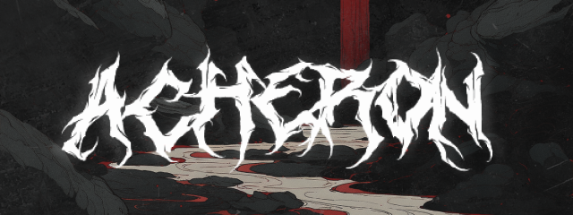

<p align="center">
    
</p>
<p align="center">
    <a href="https://github.com/f1zm0/acheron/releases"></a>
    <a href="https://pkg.go.dev/github.com/f1zm0/acheron"></a>
    <a href="https://pkg.go.dev/github.com/f1zm0/acheron"></a>
    <a href="https://github.com/f1zm0/acheron"></a>
    <a href="https://github.com/f1zm0/acheron/issues"></a>
</p>

## About

Acheron is a library inspired by [SysWhisper3](https://github.com/klezVirus/SysWhispers3)/[FreshyCalls](https://github.com/crummie5/FreshyCalls)/[RecycledGate](https://github.com/thefLink/RecycledGate), with most of the functionality implemented in Go assembly. </br>

`acheron` package can be used to add indirect syscall capabilities to your Golang tradecraft, to bypass AV/EDRs that makes use of usermode hooks and [instrumentation callbacks](https://winternl.com/detecting-manual-syscalls-from-user-mode/) to detect anomalous syscalls that don't return to ntdll.dll, when the call transition back from kernel->userland.

## Main Features

- No dependencies
- Pure Go and Go assembly implementation
- Custom string encryption/hashing function support to counter static analysis

## How it works

The following steps are performed when creating a new syscall proxy instance:

1. Walk the PEB to retrieve the base address of in-memory ntdll.dll
2. Parse the exports directory to retrieve the address of each exported function
3. Calculate the system service number for each `Zw*` function
4. Enumerate unhooked/clean `syscall;ret` gadgets in ntdll.dll, to be used as trampolines
5. Creates the proxy instance, which can be used to make indirect (or direct) syscalls

## Quickstart

Integrating `acheron` into your offsec tools is pretty easy.

You just need to call `acheron.New()` to create a syscall proxy instance and use `acheron.Syscall()` to make an indirect syscall for `Nt*` APIs.

Minimal example:

```go
package main

import (
    "fmt"
    "unsafe"

    "github.com/f1zm0/acheron"
)

func main() {
    var (
        baseAddr uintptr
        hSelf = uintptr(0xffffffffffffffff)
    )

    // creates Acheron instance, resolves SSNs, collects clean trampolines in ntdll.dlll, etc.
    ach, err := acheron.New()
    if err != nil {
        panic(err)
    }

    // indirect syscall for NtAllocateVirtualMemory s1 := ach.HashString("NtAllocateVirtualMemory"),
    if retcode, err := ach.Syscall(
        s1,                                     // function name hash
        hSelf,                                  // arg1: _In_     HANDLE ProcessHandle,
        uintptr(unsafe.Pointer(&baseAddr)),     // arg2: _Inout_  PVOID *BaseAddress,
        uintptr(unsafe.Pointer(nil)),           // arg3: _In_     ULONG_PTR ZeroBits,
        0x1000,                                 // arg4: _Inout_  PSIZE_T RegionSize,
        windows.MEM_COMMIT|windows.MEM_RESERVE, // arg5: _In_     ULONG AllocationType,
        windows.PAGE_EXECUTE_READWRITE,         // arg6: _In_     ULONG Protect
    ); err != nil {
        panic(err)
    }
    fmt.Printf(
        "allocated memory with NtAllocateVirtualMemory (status: 0x%x)\n",
        retcode,
    )

    // ...
}
```

## Examples

The following examples are included in the repository:

| Example                                       | Description                                                                                |
| --------------------------------------------- | ------------------------------------------------------------------------------------------ |
| [sc_inject](examples/sc_inject)               | Extremely simple process injection PoC, with support for both direct and indirect syscalls |
| [process_snapshot](examples/process_snapshot) | Using indirect syscalls to take process snapshots with syscalls                            |
| [custom_hashfunc](examples/custom_hashfunc)   | Example of custom encoding/hashing function that can be used with acheron                  |

Other projects that use `acheron`:

- [hades](https://github.com/f1zm0/hades)

## Contributing

Contributions are welcome! Below are some of the things that it would be nice to have in the future:

- [ ] 32-bit support
- [ ] Other resolver types (e.g. HalosGate/TartarusGate)
- [ ] More examples

If you have any suggestions or ideas, feel free to open an issue or a PR.

## References

- [Golang UK Conference 2016 - Michael Munday - Dropping Down Go Functions in Assembly](https://www.youtube.com/watch?v=9jpnFmJr2PE&t=1s)
- https://github.com/am0nsec/HellsGate
- https://sektor7.net/#!res/2021/halosgate.md
- https://github.com/trickster0/TartarusGate
- https://github.com/klezVirus/SysWhispers3
- https://github.com/crummie5/FreshyCalls
- https://github.com/boku7/AsmHalosGate
- https://github.com/thefLink/RecycledGate
- https://github.com/C-Sto/BananaPhone
- https://winternl.com/detecting-manual-syscalls-from-user-mode/
- https://www.usenix.org/legacy/events/vee06/full_papers/p154-bhansali.pdf
- https://redops.at/en/blog/direct-syscalls-a-journey-from-high-to-low

## Additional Notes

The name is a reference to the [Acheron](https://en.wikipedia.org/wiki/Acheron) river in Greek mythology, which is the river where souls of the dead are carried to the underworld.

> **Note** </br>
> This project uses [semantic versioning](https://semver.org/). Minor and patch releases should not break compatibility with previous versions. Major releases will only be used for major changes that break compatibility with previous versions.

> **Warning** </br>
> This project has been created for educational purposes only. Don't use it to on systems you don't own. The developer of this project is not responsible for any damage caused by the improper usage of the library.

## License

This project is licensed under the MIT License - see the [LICENSE](LICENSE) file for details
